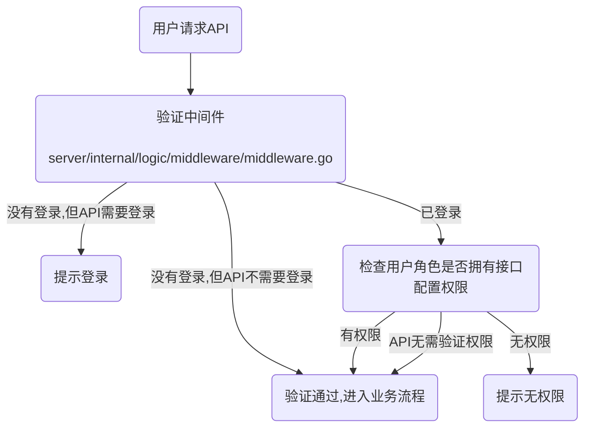

# 权限控制


## 一、菜单权限

> 菜单权限可以控制web后台菜单功能，每个菜单可以绑定一个或多个API权限，API权限决定了用户是否可以调用服务端接口。

### 为角色添加菜单权限

1、XiuAdmin后台 -> 系统管理 -> 菜单管理 -> 找到添加菜单，按照表单提示添加你的菜单信息。

2、添加菜单完成后，到 系统管理 -> 角色管理 -> 找到一位已有角色或者添加新角色 -> 在列表右侧操作栏找到菜单权限打开 -> 将第1步中添加的菜单分配给该角色即可。

### 细粒度权限

> 一般用于web后台页面上的功能按钮，对不同的角色展示不同的按钮时会用到。

1、参考【为角色添加菜单权限】添加一个按钮类型的菜单。并为菜单分配API权限，假设你分配权限是：system:post:export

2、在web页面中创建一个按钮，如下：

```vue
<template>
  <div>
    <!-- 权限校验方式1 begin -->
    <Button  v-access:code="'cpm:system:post:export'">拥有菜单的[system:post:export]权限可见</Button>
    <Button  v-access:code="'cpr:roletest'">拥有角色的[roletest]权限可见</Button>
    <!-- 权限校验方式1 end -->

    <!-- 权限校验方式2 begin -->
     <AccessControl :codes="['cpm:system:post:export']" type="code">
        <Button>拥有菜单的[system:post:export]权限可见</Button>
     </AccessControl>
    <!-- 权限校验方式2 end -->

    <!-- 权限校验方式3 begin -->
        <Button v-if="hasAccessByCodes(['cpm:system:post:export'])">拥有菜单的[system:post:export]权限可见</Button>
    <!-- 权限校验方式3 end -->  
  </div>
</template>

<script lang="ts" setup>
import { AccessControl, useAccess } from '@vben/access';
const { hasAccessByCodes } = useAccess();

</script>


```
```
// 权限码前缀说明
"cpr:"             // 角色权限码前缀+角色权限
"cpm:"             // 菜单权限码前缀+菜单权限
"cpd:"             // 部门权限码前缀+部门编码
"cpp:"             // 岗位权限码前缀+岗位编码
"cpu:"             // 用户权限码前缀+用户名
"cpc:current:user" // 当前登录用户默认权限
```

### 菜单表主要字段解释

- 代码片段：`../../server/internal/model/entity/sys_menu.go`

```go
type SysMenu struct {
	MenuId      int64       `description:"菜单ID"`
	MenuName    string      `description:"菜单名称"`
	ParentId    int64       `description:"父菜单ID"`
	Level       int         `description:"关系树等级"`
	Tree        string      `description:"关系树"`
	OrderNum    int         `description:"显示顺序"`
	Path        string      `description:"路由地址"`
	Component   string      `description:"组件路径"`
	QueryParam  string      `description:"路由参数"`
	IsFrame     int         `description:"是否为外链（0是 1否）"`
	IsCache     int         `description:"是否缓存（0缓存 1不缓存）"`
	MenuType    string      `description:"菜单类型（M目录 C菜单 F按钮）"`
	Visible     string      `description:"显示状态（0显示 1隐藏）"`
	Status      string      `description:"菜单状态（0正常 1停用）"`
	Perms       string      `description:"权限标识"`
	Icon        string      `description:"菜单图标"`
	CreatedDept int64       `description:"创建部门"`
	CreatedBy   int64       `description:"创建者"`
	CreatedAt   *gtime.Time `description:"创建时间"`
	UpdatedBy   int64       `description:"更新者"`
	UpdatedAt   *gtime.Time `description:"更新时间"`
	Remark      string      `description:"备注"`
}

```
### 特殊逻辑
> 隐藏菜单，激活上级菜单展示

配置菜单的 是否显示 `visible`字段为`1`，即可隐藏菜单  
前端界面激活显示上级菜单需要配置路由地址  
路由地址设置为 `上级菜单路由地址`-`当前菜单路由地址`   

示例：  
    字典数据的上级菜单字典管理,在菜单不显示，激活上级菜单展示  
    字典管理配置路由地址 `dict`  
    字典数据配置路由地址应配置为 `dict-data`  

#### 后端接口权限配置
接口文件 `server/api/system/v1/post.go`, 在接口的中`g.Meta`添加 `x-check-permission` tag，值为权限码，即可实现接口权限校验.
校验菜单的[system:post:list]权限,示例： 
```go
type PostListReq struct {
	g.Meta `path:"/post/list" method:"get" tags:"系统-岗位管理" summary:"获取岗位列表" x-check-permission:"cpm:system:post:list"`
	*model.SysPostListParam
}
```

### API权限验证流程




#### 菜单权限添加或修改后多久生效？

- API权限实时生效，web后台菜单刷新页面后生效，无需重启服务

### 权限通配符

> 菜单的权限标识支持通配符 `*`，用于简化权限分配。当菜单权限标识以 `*` 结尾时，表示拥有该前缀下的所有权限。

#### 使用示例

在菜单管理中，将权限标识配置为 `system:user:*`，则该用户将自动拥有以下所有权限：

- `system:user:query` - 查询
- `system:user:add` - 新增
- `system:user:edit` - 修改
- `system:user:remove` - 删除
- `system:user:export` - 导出
- `system:user:import` - 导入
- `system:user:resetPwd` - 重置密码
- 以及其他所有以 `system:user:` 开头的权限

#### 匹配规则

1. **精确匹配优先**：如果用户拥有精确的权限码（如 `cpm:system:user:query`），优先使用精确匹配
2. **通配符匹配**：如果用户拥有通配符权限码（如 `cpm:system:user:*`），则匹配所有以 `cpm:system:user:` 开头的权限码
3. **多级通配**：`system:*` 可以匹配 `system:user:query`、`system:role:list` 等所有以 `system:` 开头的权限
4. **前后端同步**：通配符匹配同时在后端中间件（API权限校验）和前端（按钮/组件权限控制）生效

#### 后端接口权限配置示例

接口权限校验不变，仍然使用具体权限码：
```go
type UserListReq struct {
	g.Meta `path:"/user/list" method:"get" tags:"系统-用户管理" summary:"获取用户列表" x-check-permission:"cpm:system:user:query"`
	*model.SysUserListParam
}
```

即使用户只拥有 `cpm:system:user:*` 权限（而非精确的 `cpm:system:user:query`），也能通过权限校验。

#### 前端权限控制示例

前端权限校验同样支持通配符匹配：
```vue
<!-- 用户拥有 cpm:system:user:* 权限时，以下按钮均可见 -->
<Button v-access:code="'cpm:system:user:add'">新增</Button>
<Button v-access:code="'cpm:system:user:edit'">修改</Button>
<Button v-access:code="'cpm:system:user:remove'">删除</Button>
```


## 二、数据权限

> 数据权限是某人只能看到某些数据，可以为某人设置一定的数据范围，让其只能看到允许他看到的数据。


### 目前已经支持的数据权限如下
 1全部数据权限 2自定数据权限 3本部门数据权限 4本部门及以下数据权限 5仅本人数据权限 6本部门及以下或本人数据权限
 
| 数据范围    | 描述                                         |
|---------|--------------------------------------------|
| 全部权限    | 不做过滤，可以查看所有数据                              |
| 自定义部门   | 可以看到设置的指定部门，支持多个                           |
| 本部门数据权限    | 仅可以看到所属部门下的数据                              |
| 本部门及以下数据权限 | 仅可以看到所属以及下级部门的数据                           |
| 仅本人数据权限     | 仅可以看到自己的数据                                 |
| 本部门及以下或本人数据权限 | 仅可以看到自己和全部下级的数据 |

### 如何区分部门和下级用户？
- 在实际使用时，部门更多的是在公司或机构中使用，可以通过在 组织管理 -> 后台用户 ->为用户绑定部门

### 如何判断数据是谁的？

- 在数据库建表时，只要表中包含字段：`user_id`或`created_by`即可过滤 [仅自己、本部门及以下或本人数据权限] 类型的数据权限
- 在数据库建表时，只要表中包含字段：`dept_id`或`created_dept`即可过滤 [自定义部门、本部门、本部门及以下、本部门及以下或本人数据权限] 类型的数据权限

### 如何在具体业务中使用数据权限过滤？

- 只需在查询、更新或删除等ORM链式操作中加入相应`Handler`方法即可

- 如果你想对Handler有更多详细了解，请查看：https://goframe.org/pages/viewpage.action?pageId=20087340

- 下面提供一个简单使用例子：

```go
package main

import (
	"context"
	"xiuadmin/internal/dao"
	"xiuadmin/internal/library/xgorm/handler"
)

func test(ctx context.Context)  {
    dao.SysPost.Ctx(ctx).Where("id", 1).Handler(handler.FilterAuth).Scan(&res)
}
```


